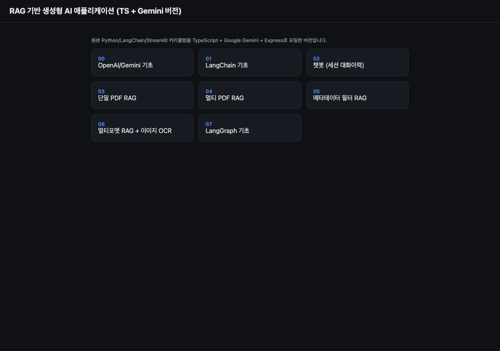
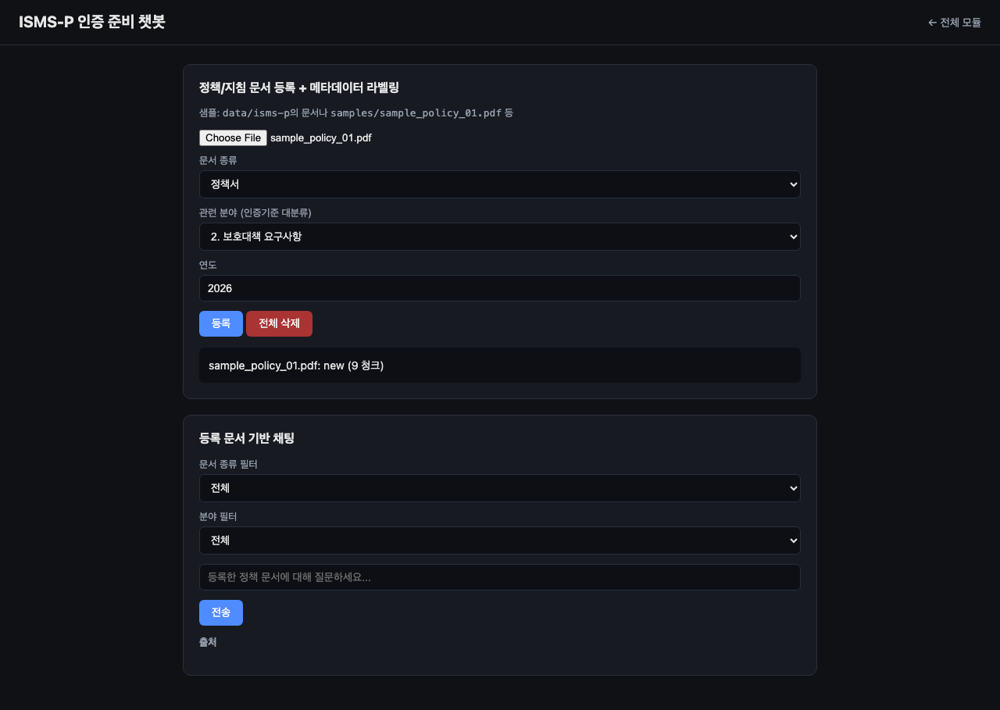
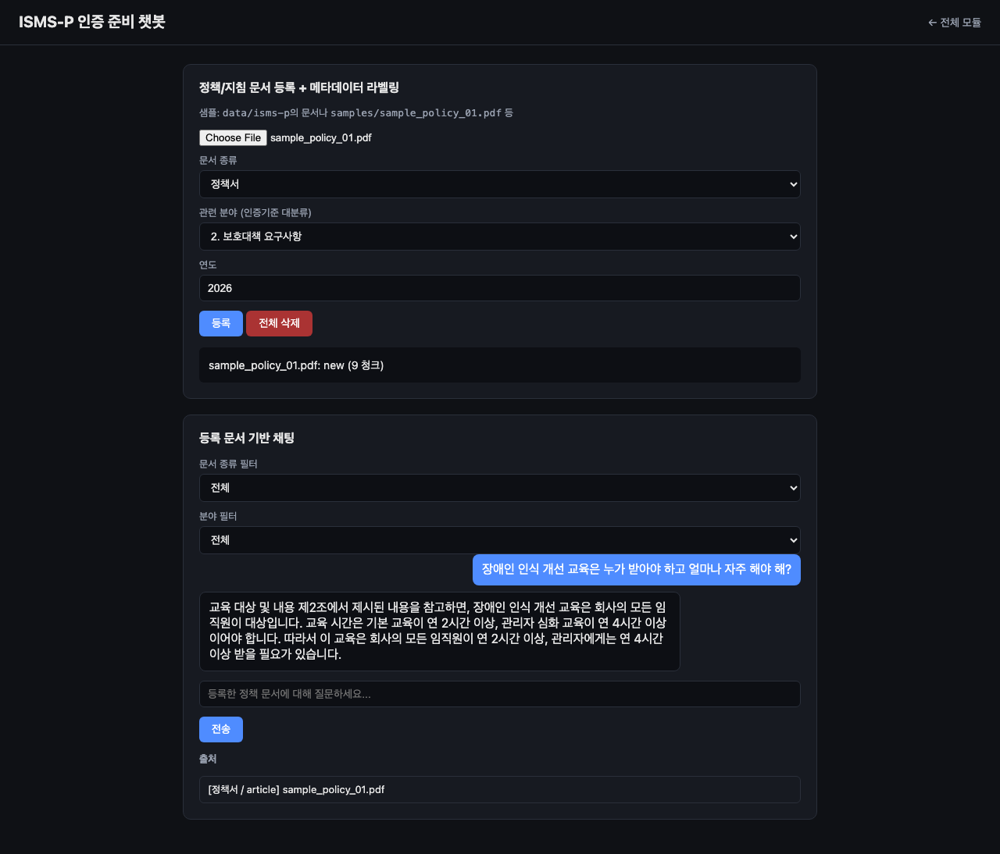

# RAG 시스템 (TypeScript + Gemini/Ollama)

Java/Spring 백엔드 개발자로 일하며 RAG·AI Agent 개발 역량을 실전으로 쌓기 위해 시작한 프로젝트입니다. LLM은 **Google Gemini(클라우드)** 또는 **Ollama(로컬, 예: Qwen)** 중 하나를 환경변수 하나로 선택할 수 있습니다.

목표는 **영세 기업이 외부 컨설팅 없이 ISMS-P 인증심사를 준비할 수 있도록 돕는 자동화 챗봇**을 만드는 것입니다. 자세한 내용은 [사용 예시](#사용-예시) / [ISMS-P 인증 자동화 확장 (진행 중)](#isms-p-인증-자동화-확장-진행-중) 참고.

## 실행 방법

```bash
npm install
cp .env.example .env
npm run dev
```

브라우저에서 `http://localhost:3000` 접속 → 00~07 모듈 링크로 이동.

- `npm run dev` — 개발 모드(파일 변경 자동 반영)
- `npm run build` / `npm start` — 프로덕션 빌드 후 실행
- `npm run typecheck` — 타입 체크만 실행

### Gemini로 실행 (기본값)

`.env`에서 `LLM_PROVIDER=gemini`로 두고, `GOOGLE_API_KEY`를 [Google AI Studio](https://aistudio.google.com/apikey)에서 발급받아 입력하세요.

### Ollama(로컬 Qwen)로 실행

```bash
brew install ollama          # 또는 https://ollama.com 에서 설치
ollama serve                  # 로컬 서버 (백그라운드로 계속 켜둬야 함)
ollama pull qwen2.5:3b         # 채팅 모델 (~1.9GB)
ollama pull nomic-embed-text   # 임베딩 모델 (~274MB)
```

`.env`에서 `LLM_PROVIDER=ollama`로 바꾸면 됩니다 (`GOOGLE_API_KEY` 불필요). 나머지 코드는 전혀 손댈 필요 없이 동일하게 동작합니다 — `src/llm/provider.ts`가 `ChatGoogleGenerativeAI`/`ChatOllama` 중 어느 쪽을 반환하든 둘 다 LangChain의 동일한 `BaseChatModel` 인터페이스(`.invoke()`, `.pipe()`)를 구현하기 때문입니다.

**주의**:
- `OLLAMA_BASE_URL`은 `localhost`가 아니라 `127.0.0.1`을 씁니다 — Node의 `fetch`가 `localhost`를 IPv6(`::1`)로 먼저 시도하는데 Ollama는 기본적으로 IPv4에만 바인딩되어 연결이 거부되기 때문입니다.
- 06(멀티포맷 RAG)의 이미지 OCR은 텍스트 전용 모델(Qwen2.5)로는 처리할 수 없어, `LLM_PROVIDER=ollama`일 때 이미지 업로드 시 에러를 반환합니다. 이미지가 필요하면 Gemini로 전환하거나 Ollama에서 `qwen2.5vl`/`llava` 같은 비전 모델을 pull 받아 `OLLAMA_CHAT_MODEL`을 바꾸세요.
- 구조화된 JSON 출력(00/step3, 07 evaluator 등)은 `qwen2.5:3b`에서 LangChain의 기본 `withStructuredOutput`(tool-calling/jsonSchema 그래머)이 신뢰할 수 없어서(모델이 이상한 tool-call 형태로 응답), `src/llm/provider.ts`의 `generateStructured()`가 provider별로 분기합니다: Ollama에서는 Ollama 자체 `format: "json"` 모드(자유형 JSON 강제) + 스키마의 `.describe()`로 만든 필드 힌트 + zod 검증으로 처리합니다. 실제 테스트로 정상 동작 확인함.
- 메모리/디스크가 빠듯한 환경(예: 8GB RAM)에서는 `qwen2.5:3b`처럼 작은 모델을 권장합니다. `qwen2.5:7b` 이상은 다른 앱을 다 끄고 써야 할 정도로 무거울 수 있어요.

## 사용 예시 — ISMS-P 인증 준비 챗봇

`http://localhost:3000/isms-p/` — 기업이 보유한 정책/지침 문서를 등록하면서 문서 종류·관련 분야·연도를 메타데이터로 태깅하고, 이후 그 문서에 대해 질문하면 등록된 문서만 근거로 답변합니다.



**문서 등록 + 메타데이터 라벨링** — 업로드 시 "제N조" 형식 조문이 일정 개수 이상 감지되면 조 단위로 청킹하고(`chunk_strategy: article`), 아니면 일반 재귀 분할로 자동 폴백합니다.



**등록 문서 기반 채팅** — 아래 예시는 실제로 문서를 등록하고 질문한 결과입니다. 답변이 "제2조"를 정확히 인용하고, 출처에 어떤 청킹 전략(article)이 쓰였는지까지 표시됩니다.



## 프로젝트 구조

```
src/
  server.ts              # Express 엔트리포인트, 라우터 마운트
  config/env.ts          # 환경변수 로딩 (.env)
  llm/provider.ts         # Gemini/Ollama 프로바이더 팩토리 (createChatModel/createEmbeddings/generateStructured)
  loaders/                # 문서 로더 (PDF/CSV/DOCX/PPTX/이미지 등 포맷별 → LangChain Document)
  vectorstore/
    store.ts              # HNSWLib 래퍼 — 네임스페이스별 인메모리 인덱스 캐시, JSON 사이드카 영속화, 배치 임베딩
    ragChain.ts           # answerFromDocs — 검색 + LLM 응답 체인
  pdf/renderPage.ts       # PDF 페이지 → PNG 래스터화 (미리보기용)
  modules/00-07-*/         # 커리큘럼 각 모듈의 step별 로직 (라우트에서 호출)
  modules/isms-p/
    chunkPolicyDoc.ts       # 장-조-항 청킹 (조문 밀도 검사 후 폴백)
    step1_ingest_company_doc.ts  # 문서 등록 + 메타데이터 태깅 + 해시 업서트
    step2_chat.ts           # 메타데이터 필터 기반 채팅
  routes/00-07-*.ts        # 모듈별 Express 라우터
  routes/isms-p.ts          # ISMS-P 챗봇 라우터

public/
  index.html              # 모듈 목록 페이지
  00-07-*/                 # 모듈별 정적 HTML/JS 프론트엔드
  isms-p/                  # ISMS-P 인증 준비 챗봇 프론트엔드

scripts/                  # 반복 실행하는 1회성 파이프라인 스크립트 (npm run <name>으로 실행)
  parse-criteria.ts        # ISMS-P 인증기준 xlsx → data/isms-criteria.json 파싱
  ingest-isms-p.ts         # data/isms-p/*.pdf를 source_file 메타데이터와 함께 벡터스토어에 색인
  search-isms-p.ts         # source_file 필터를 적용한 벡터 유사도 검색 CLI

data/
  isms-criteria.json       # (git 추적됨) ISMS-P 인증기준 마스터 데이터 — 101개 항목, 328개 세부 확인사항
  isms-p/, vectorstore/, pdf-pages/  # (git 미추적, 런타임 생성) 원본 문서, 벡터 인덱스, PDF 캐시

docs/
  isms-p-automation-plan.md  # ISMS-P 자동화 챗봇 설계 문서
  screenshots/                # 이 README에 쓰인 캡처

samples/                  # 각 모듈 데모용 샘플 문서 (계약서/정책/매뉴얼/보고서 등)
```

## ISMS-P 인증 자동화 확장 (진행 중)

논문 ["RAG와 OCR 기술을 활용한 LLM 기반 정보보호 관리체계(ISMS) 인증관리 자동화 시스템"](docs/isms-p-automation-plan.md)을 참고해, 영세 기업이 외부 컨설팅 없이 ISMS-P 인증심사를 준비할 수 있도록 돕는 챗봇으로 확장 중입니다. 설계 배경과 단계별 계획은 [`docs/isms-p-automation-plan.md`](docs/isms-p-automation-plan.md)에 정리되어 있습니다.

**현재까지 구현된 것**:
- **ISMS-P 인증 준비 챗봇** (`/isms-p/`, `src/modules/isms-p/`) — 기업 정책 문서 등록 + 메타데이터(문서 종류/관련 분야/연도) 라벨링, 조문("제N조") 밀도를 검사해 조 단위 청킹 또는 일반 재귀 분할로 자동 폴백, 메타데이터 필터 기반 채팅
- KISA 공개 "ISMS-P 인증기준 세부점검항목" 데이터를 파싱해 101개 인증기준 항목·328개 세부 확인사항을 구조화한 마스터 데이터(`data/isms-criteria.json`) 자동 생성 (`scripts/parse-criteria.ts`)
- 문서 적재 시 `source_file`/`file_hash` 메타데이터 태깅 → 파일 단위 신규/변경/중복 판별 후 변경분만 재색인하는 업서트 파이프라인
- 로컬 LLM(Ollama) 임베딩 환경에서 대용량 문서(200페이지+) 색인 시 단일 배치 요청이 실패하는 문제를 배치 단위 임베딩으로 해결

**아직 구현되지 않은 것**: 인증기준 항목별 근거 문서 자동 매칭(2단계 재평가: 벡터 유사도 → LLM 적합도 재판정), 증적 자료 적정성 판정, GAP 분석 리포트 — 설계는 완료되었고 구현 예정입니다.

## 알아둘 점

- **무료 티어 API 할당량**: Gemini API 무료 티어는 **모델당 하루 20회 요청**으로 제한됩니다(예: `generativelanguage.googleapis.com/generate_content_free_tier_requests`). 07의 step3/step4처럼 한 번의 실행이 내부적으로 LLM을 여러 번 호출하는 경우 금방 소진될 수 있습니다. 결제를 활성화하면 한도가 크게 늘어납니다.
- **모델명**: `.env`의 `GEMINI_CHAT_MODEL`/`GEMINI_EMBEDDING_MODEL`은 `-latest` 별칭(`gemini-flash-latest`, `gemini-embedding-001`)을 기본값으로 사용합니다. Google이 구체적인 버전 스냅샷(예: `gemini-2.5-flash`)을 신규 사용자에게 더 이상 제공하지 않는 경우가 있어, 별칭을 쓰는 편이 안전합니다.
- **07/step4 재검색 루프**: 원본은 k=2로 재검색을 유도했지만, Gemini 임베딩 공간에서는 k=1로 좁혀야 "NovaCore → Qubrix → 매출" 2-hop 재검색이 안정적으로 재현됩니다.
- **pptx**: 전용 LangChain.js 로더가 없어 `officeparser`로 텍스트만 추출합니다(레이아웃/이미지 정보 없음).
- **PDF 페이지 미리보기**: 첫 렌더링 시 `data/pdf-pages/`에 PNG로 캐싱됩니다.

## 검증 상태

- `npm run typecheck` 통과
- **Gemini**로 확인: 00(채팅/구조화 출력), 01, 03(PDF 업로드→청킹→임베딩→저장→채팅→출처→페이지 이미지), 07/step1 — Gemini 무료 티어의 모델당 하루 20회 요청 제한으로 나머지는 curl로 개별 확인은 못 했지만 동일한 공용 로직을 재사용하는 구조입니다.
- **Ollama(qwen2.5:3b + nomic-embed-text)**로 확인: 00(채팅/구조화 출력), 03(임베딩 유사도, PDF RAG 채팅+출처), 07(step1 선형 그래프, step2 조건 분기) — 로컬이라 할당량 제약 없이 실제 호출로 검증함.
